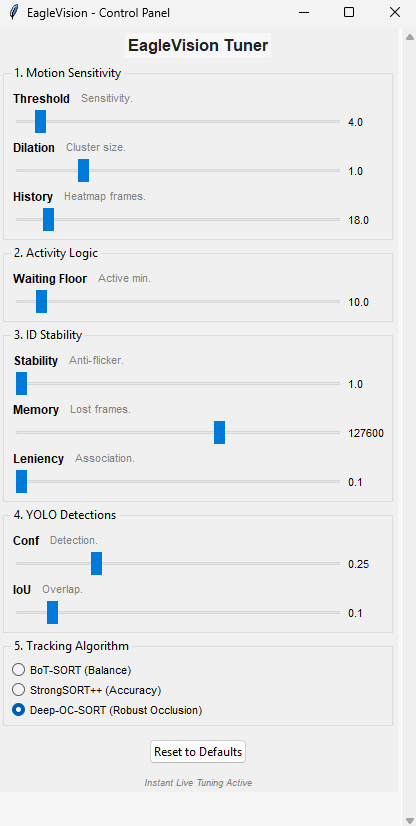
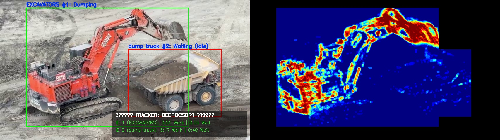

# EagleVision: Construction Equipment Monitoring & Analytics

EagleVision is a high-performance system designed for real-time monitoring of construction equipment. It combines deep learning for object detection, advanced temporal heatmap analysis, and a specialized secondary YOLO classification model to distinguish between stationary equipment and complex articulated motion (like digging, swinging, and dumping).

## 🧪 Model Training (Google Colab)

[](https://colab.research.google.com/drive/1v10q56t3xePM5d2VELDXCam7t2kToET0?usp=sharing)
## 📸 Output Preview




## 🎥 Demonstration Video

[](https://youtu.be/ejC5qRzuI4Q)

The model training notebook is available on Google Colab. It walks through the full training pipeline for the activity classification and detection models used in EagleVision.

## 🚀 Key Features

### 1. Advanced Tracking & ID Stability
- **Multi-Tracker Support**: Real-time switching between **BoT-SORT**, **StrongSORT++**, and **Deep-OC-SORT**.
  - **BoT-SORT**: Balanced performance with Global Motion Compensation (GMC). Optimized for high-end GPUs.
  - **StrongSORT++**: accuracy-focused using heavy ReID features.
  - **Deep-OC-SORT**: Optimized for heavy occlusions and non-linear machine movements (e.g., excavator rotations).
- **Proprietary ID Stabilization Layer**: A post-processing anti-ID-switch layer that handles the "Centroid Jump" problem during machine rotations.
  #### 4-Layer Matching Strategy:
  - **Layer 1: Raw-ID Continuity**: Zero-cost mapping for standard tracker persistence.
  - **Layer 2: Single-Instance Fast-Path**: Pose-change resistant logic that matches 1 lost track with 1 new detection of the same class when unique on site.
  - **Layer 3: Zone-Anchor Matching**: Spatial memory using a running mean centroid (anchor) to snap detections back to stable IDs.
  - **Layer 4: Trajectory Prediction**: Physics-aware fallback using linear extrapolation and box expansion.

### 2. Intelligent Activity Classification
- **Deep Learning Action Classifier**: When an excavator is detected as active, its cropped bounding box is passed to a secondary, specialized classification model (`classfy.pt`) to recognized **Swinging**, **Dumping**, or **Digging**.
- **Temporal Heatmap Analysis**: Accumulates motion masks to visualize "activity density" and bypass deep-learning checks when equipment is completely stationary ("Waiting").
- **Stability Voting**: A temporal voting queue ensures smoothed, flicker-free activity status.

### 3. Distributed Data Pipeline
- **Kafka Streaming**: Streams real-time telemetry (ID, status, activity, utilization) to a Kafka topic.
- **Analytics Dashboard**: A **Streamlit** Web-UI providing realtime counters, historical utilization trends, and activity breakdown charts.
- **Data Persistence**: Telemetry is automatically persisted into a database (SQLite/Postgres).

### 4. Live Tuning GUI
- **Instant Live Tuning**: Adjust motion sensitivity, waiting thresholds, and tracker parameters (like `track_buffer` and `match_thresh`) on-the-fly.
- **Dynamic Config**: Safely rewrites `.yaml` configurations and `settings.json` reflected instantly in the video stream.

### 5. Flexible Analysis Modes
- **Full Pipeline (`main.py`)**: Complete analytics with Heatmaps, Action Classification, and Kafka streaming.
- **Tracking-Only Mode (`main_track.py`)**: Speed-optimized mode focused strictly on high-performance tracking and ID stability (no heatmap/activity processing).

## 🛠 Project Structure

- `main.py`: The core processor. Handles detection, tracking, activity classification, and Kafka streaming.
- `main_track.py`: High-speed tracking-only entry point with optimized ID stabilization.
- `setting.py`: The Control Panel GUI for live parameter tuning.
- `config.py` & `settings.json`: System-wide parameters and live state management.
- `botsort.yaml`, `deepocsort.yaml`, `strongsort.yaml`: Specialized tracker configurations.
- `consumer.py` & `database.py`: The telemetry backbone for persisting Kafka streams.
- `dashboard.py`: The analytics Streamlit app.

## 🏁 Getting Started

### Prerequisites
- Python 3.9+
- Docker (optional, for full microservices stack)

### Quick Start
1. **Install dependencies**:
   ```bash
   pip install -r requirements.txt
   ```
2. **Run the Full Pipeline**:
   ```bash
   python main.py
   ```
3. **Run High-Speed Tracking Only**:
   ```bash
   python main_track.py
   ```

## 📐 Technical Methodology
EagleVision employs a dual-stage architecture. By using a fast YOLO detector paired with resilient motion compensators (BoT-SORT/Deep-OC-SORT), bounding boxes are reliably anchored. Instead of forcing heavy logic into one layer, Eagle Vision isolates complex poses into a distinct sub-classifier (`classfy.pt`), while maintaining algorithmic speed through mathematical temporal heatmaps that filter out "Waiting" machines.

## ⚠️ Proof of Concept Limitations
- **Camera Movement**: Accuracy may degrade if the camera is actively moving or vibrating.
- **Class Overlap**: Heavy overlap between equipment may impact detection accuracy.

## 🛣️ Commercial Roadmap
- **Excavator Pose Estimation**: Transitioning to keypoint tracking for deterministic activity classification.
- **Instance Segmentation**: Pixel-perfect masking for trucks to solve overlap issues in loading zones.
